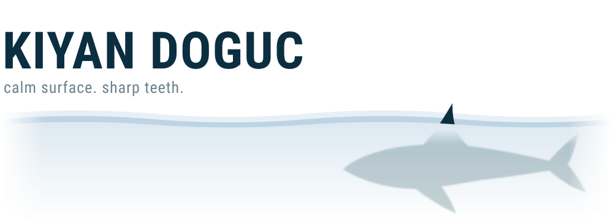
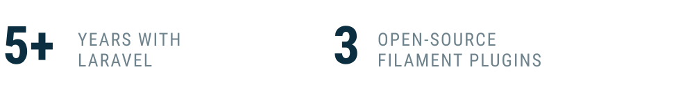

<picture>
  <source media="(prefers-color-scheme: dark)" srcset="assets/hero-dark.svg">
  
</picture>

Software developer from Germany. I build web apps and APIs, mostly with **Laravel** and **Filament**. Beyond that, I spend a lot of time on **AI**: developing my own models, running LLMs locally and training them on my own hardware.

<picture>
  <source media="(prefers-color-scheme: dark)" srcset="assets/stats-dark.svg">
  
</picture>

### Open source

- [**drosophila-brain-mlx**](https://github.com/Kisame76/drosophila-brain-mlx): the published Shiu et al. fruit fly brain model (127,400 neurons, 14.7 M synapses) in Apple MLX with a custom Metal kernel, 0.29 s per biological second against 62.6 s for the Brian2 reference
- [**filament-advanced-rich-editor**](https://github.com/Kisame76/filament-advanced-rich-editor): a drop-in RichEditor with a toolbar you arrange yourself, a media browser and a slash menu
- [**filament-tree-table**](https://github.com/Kisame76/filament-tree-table): expandable parent/child rows for Filament tables
- [**filament-db-table-state**](https://github.com/Kisame76/filament-db-table-state): filters, sorting and columns saved per user, across devices

### Stack

<samp>Laravel · Filament · PHP · Python · TypeScript · PostgreSQL · Docker · Ollama · llama.cpp · MLX</samp>

### Contact

[kisame-labs.com](https://kisame-labs.com) · [LinkedIn](https://www.linkedin.com/in/kiyan-doguc-a82142162/) · [info@kisame-labs.com](mailto:info@kisame-labs.com)

 

dive deeper ↓

 

−10,911 m. Nothing down here but pressure, a fish that looks like a rendering bug, and you. 
You kept clicking. Respect. [Throw a message in a bottle](https://github.com/Kisame76/Kisame76/issues/new?title=Hello%20from%2010%2C911%20m).

